# Price Insight - Hệ thống Web Scraping thu thập và phân tích biến động giá sản phẩm

[](https://www.oracle.com/java/)
[](https://www.python.org/)
[](https://www.mysql.com/)
[](LICENSE)

> **Hệ thống giám sát và phân tích giá sản phẩm từ sàn TMĐT Tiki theo thời gian thực, giúp người dùng theo dõi biến động giá và tìm kiếm deal tốt nhất.**

---

## Mục Lục

- [Mô Tả Tổng Quan](#mô-tả-tổng-quan)
- [Cấu Trúc Thư Mục](#cấu-trúc-thư-mục)
- [Danh Sách Chức Năng](#danh-sách-chức-năng-chính)
- [Công Nghệ và Tool](#công-nghệ-và-tool-sử-dụng)
- [Kiến Trúc Hệ Thống](#kiến-trúc-hệ-thống)
- [Hướng Dẫn Cài Đặt](#hướng-dẫn-cài-đặt-chi-tiết)
- [Hình Ảnh Demo](#hình-ảnh-demo-và-screenshots)
- [Contributors](#contributors)

---

## Mô Tả Tổng Quan

**Price Insight** là một hệ thống giám sát giá sản phẩm tự động, được xây dựng với kiến trúc **Client-Server** sử dụng giao thức **TCP/IP** và **WebSocket** để truyền tải dữ liệu theo thời gian thực.

### Vấn Đề Giải Quyết

- **Khó khăn trong việc theo dõi giá**: Người mua hàng online thường phải liên tục kiểm tra giá sản phẩm trên nhiều sàn TMĐT
- **Bỏ lỡ deal tốt**: Không nắm bắt được thời điểm giảm giá sâu
- **Thiếu dữ liệu lịch sử**: Không có công cụ để xem xu hướng biến động giá theo thời gian

### Giải Pháp

Price Insight tự động cào dữ liệu giá từ **Tiki** theo lịch trình, lưu trữ lịch sử giá vào database và cung cấp giao diện web thân thiện để:
- Tìm kiếm và so sánh giá sản phẩm
- Xem biểu đồ lịch sử giá
- Cập nhật giá realtime khi người dùng truy cập sản phẩm
- Cho phép theo dõi giá sản phẩm mà bạn muốn
- Lọc sản phẩm theo loại deal (Flash Sale, Hot Deal, Trending)

---

## Cấu Trúc Thư Mục

```
PROJECT_PRICE_TRACKER/
│
├── server/                          # Java Backend Server
│   ├── src/                         # Source code
│   │   └── com/pricetracker/server/
│   │       ├── Main.java            # Entry point
│   │       ├── core/
│   │       │   └── PriceTrackerServer.java
│   │       ├── http/
│   │       │   └── SimpleHttpServer.java
│   │       ├── websocket/
│   │       │   └── PriceWebSocketServer.java
│   │       ├── db/
│   │       │   ├── DatabaseConnectionManager.java
│   │       │   ├── ProductDAO.java
│   │       │   ├── PriceHistoryDAO.java
│   │       │   └── ReviewDAO.java
│   │       ├── handler/             # Request handlers
│   │       ├── crypto/              # SSL/TLS encryption
│   │       └── utils/               # Utilities
│   ├── lib/                         # JAR dependencies
│   │   ├── mysql-connector-j-9.1.0.jar
│   │   ├── HikariCP-5.1.0.jar
│   │   ├── Java-WebSocket-1.5.3.jar
│   │   ├── gson-2.11.0.jar
│   │   └── slf4j-*.jar
│   └── certs/                       # SSL certificates
│
├── scraper/                         # Python Scraper
│   ├── scraper.py                   # Main scraper script
│   ├── send_email.py                # Email notification
│   ├── check_db.py                  # Database checker
│   ├── config.ini                   # Configuration
│   ├── initial_setup.py             # Setup database
│   ├── task_scheduler.xml           # Windows Task Scheduler
│   └── logs/                        # Scraper logs
│
├── frontend/                        # Frontend HTML/CSS/JS
│   ├── HTML/
│   │   ├── index.html           # Homepage
│   │   ├── timKiem.html            # Search page
│   │   ├── giamGia.html            # Deals page
│   │   ├── Trangchitiet.html       # Product detail
│   │   └── danhMuc.html            # Categories
│   ├── CSS/                         # Stylesheets
│   └── JS/
│       ├── Trangchu.js
│       ├── timKiem.js
│       ├── websocket.js            # WebSocket client
│       └── loadFrame.js
│
├── shared/                          # Shared models (Java)
│   └── src/com/pricetracker/
│       ├── models/                  # Data models
│       │   ├── Product.java
│       │   ├── PriceHistory.java
│       │   ├── Review.java
│       │   └── Request.java
│       └── security/                # Security utilities
│
├── client/                          # Java Client (Optional)
│   └── src/com/pricetracker/client/
│       ├── Main.java
│       ├── net/NetworkClient.java
│       └── ui/                      # Swing UI panels
│
├── k6/                              # Load testing
│   └── demo.js                      # k6 test script
│
├── ThongTinDuAn/                    # Project documentation
│   ├── images/                      # Screenshots & diagrams
│   └── PseudoCode_va_Flowchart.txt
│
├── start-server.bat                 # Quick start script
├── README.md                        # Documentation
└── AI_SETUP.md                      # AI-generated setup guide
```

### Giải Thích Cấu Trúc

- **server/**: Backend Java xử lý HTTP requests (port 8080), WebSocket (port 8081), và kết nối database
- **scraper/**: Python script tự động cào giá từ Tiki API theo lịch trình
- **frontend/**: Giao diện web tĩnh (HTML/CSS/JS) hiển thị dữ liệu và tương tác với server
- **shared/**: Các class model được chia sẻ giữa server và client
- **ThongTinDuAn/**: Tài liệu dự án, screenshots, và diagrams

---

## Sơ Đồ Giao Thức TCP trong Dự Án

### Kiến Trúc TCP Client-Server

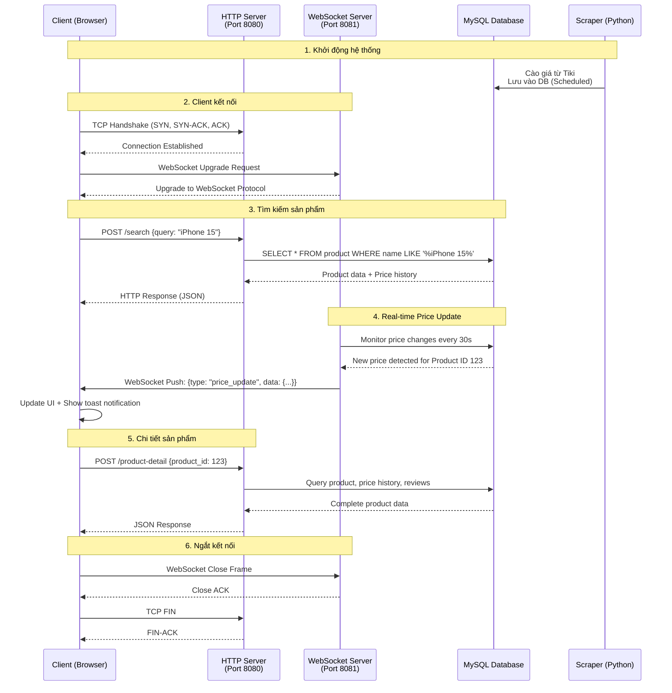

### Giải Thích Chi Tiết

#### 1. Bắt Tay Ba Bước TCP (TCP Three-Way Handshake)
```
Client                    Server
  |                          |
  |-------- SYN ------------>|  (Client yêu cầu kết nối)
  |<------ SYN-ACK ----------|  (Server chấp nhận + gửi ACK)
  |-------- ACK ------------>|  (Client xác nhận)
  |                          |
  |   Connection Established |
```

#### 2. Giao Thức HTTP Request/Response trên TCP
- Client gửi HTTP Request qua TCP socket
- Server xử lý và trả về HTTP Response
- Sử dụng **Connection: keep-alive** để tái sử dụng kết nối TCP

#### 3. Nâng Cấp Giao Thức WebSocket
```http
GET / HTTP/1.1
Upgrade: websocket
Connection: Upgrade
```
- Bắt đầu bằng HTTP request
- Server "nâng cấp" kết nối lên WebSocket
- Duy trì **kết nối hai chiều liên tục** cho cập nhật theo thời gian thực

#### 4. Luồng Dữ Liệu
- **HTTP (Port 8080)**: Mô hình Request/Response cho các thao tác CRUD
- **WebSocket (Port 8081)**: Đẩy dữ liệu từ Server xuống Client cho cập nhật giá
- **Cơ sở dữ liệu**: Lưu trữ sản phẩm, giá, đánh giá, danh mục

---

## Danh Sách Chức Năng Chính

### 1. Thu Thập Dữ Liệu (Web Scraping)
- **Tự động cào dữ liệu** từ Tiki API theo lịch trình (mặc định: mỗi ngày)
- Thu thập thông tin:
  - Tên sản phẩm, thương hiệu, hình ảnh, mô tả
  - Giá hiện tại, giá gốc, % giảm giá
  - Loại deal (Flash Sale, Hot Deal, Trending, Normal)
  - Review và đánh giá của khách hàng
- **Retry logic** thông minh khi gặp lỗi
- **Email notification** khi hoàn thành/thất bại

### 2. Quản Lý và Lưu Trữ
- **MySQL Database** với schema tối ưu:
  - Bảng `product`: Thông tin sản phẩm
  - Bảng `price_history`: Lịch sử giá theo thời gian
  - Bảng `product_group`: Danh mục sản phẩm
  - Bảng `review`: Đánh giá của khách hàng
  - Bảng `scrape_log`: Log hoạt động của scraper
- **HikariCP Connection Pool** (30 connections) cho hiệu suất cao
- Tự động ghi nhận biến động giá với timestamp

### 3. Giao Diện Web (Frontend)
#### Trang Chủ
- Giới thiệu về website
- Thanh tìm kiếm thông minh
- Categories navigation

#### Tìm Kiếm Sản Phẩm
- **Tìm theo URL**: Paste link Tiki để thêm sản phẩm mới
- **Tìm theo tên**: Search gần đúng với LIKE query
- **Tìm theo danh mục**: Lọc theo product group
- Hiển thị kết quả dạng grid với ảnh, giá, discount

#### Trang Giảm Giá (Deals)
- Lọc theo loại deal:
  - Flash Sale
  - Hot Deal (giảm trên 30%)
  - Trending
- Badge hiển thị % giảm giá
- Sort theo mức giảm giá

#### Chi Tiết Sản Phẩm
- Thông tin đầy đủ: Tên, brand, mô tả, hình ảnh
- **Biểu đồ lịch sử giá** (Chart.js) - Line chart theo thời gian
- **Reviews và ratings** của khách hàng
- **Sản phẩm tương tự** (same category)
- **Nút "Làm mới giá"**: Cào giá mới từ Tiki real-time

### 4. Cập Nhật Giá Theo Thời Gian Thực (WebSocket)
- **WebSocket Server (Port 8081)** với phát sóng bất đồng bộ
- **Thông báo Toast** khi giá thay đổi
- Tự động cập nhật giao diện không cần tải lại trang
- Giám sát cơ sở dữ liệu mỗi 30 giây để phát hiện thay đổi
- **Chỉ báo trạng thái kết nối** (chấm xanh = đã kết nối)

### 5. Máy Chủ HTTP API (Port 8080)
Cung cấp RESTful API cho giao diện người dùng:

| Endpoint | Method | Mô tả |
|----------|--------|-------|
| `/search` | POST | Tìm kiếm sản phẩm (by URL, name, category) |
| `/deals` | GET/POST | Lấy danh sách deals (filter by type) |
| `/product-detail` | POST | Chi tiết sản phẩm + price history + reviews |
| `/refresh-price` | POST | Force scrape giá mới từ Tiki |
| `/categories` | GET | Lấy danh sách categories với product count |
| `/metrics` | GET | System monitoring (cache, thread pool, DB stats) |

### 6. Tối Ưu Hiệu Năng
- **In-memory Cache** với TTL 5 phút - Giảm 90% DB queries
- **Thread Pool** (100 threads) cho HTTP requests
- **HikariCP** với 30 connections cho DB
- **Async WebSocket Broadcast** (50 threads) - Gửi tới 50 clients trong dưới 200ms
- **Metrics endpoint** để monitoring cache hit rate, DB connections, memory

---

## Công Nghệ và Tool Sử Dụng

### Nền Tảng Backend
| Công nghệ | Phiên bản | Mục đích |
|-----------|-----------|----------|
| **Java** | 17+ | Máy chủ chính (TCP/HTTP/WebSocket) |
| **MySQL** | 8.0+ | Cơ sở dữ liệu lưu trữ |
| **HikariCP** | 5.1.0 | Quản lý nhóm kết nối |
| **Java-WebSocket** | 1.5.3 | Giao tiếp thời gian thực |
| **Gson** | 2.10.1 | Chuyển đổi JSON |
| **SLF4J** | 2.0.9 | Framework ghi log |

### Thu Thập Dữ Liệu Web
| Công nghệ | Phiên bản | Mục đích |
|-----------|-----------|----------|
| **Python** | 3.8+ | Script thu thập dữ liệu |
| **Requests** | Mới nhất | HTTP client |
| **mysql-connector-python** | Mới nhất | Kết nối cơ sở dữ liệu |

### Giao Diện Người Dùng
| Công nghệ | Mục đích |
|-----------|----------|
| **HTML5/CSS3** | Cấu trúc và giao diện |
| **JavaScript (ES6+)** | Logic xử lý phía client |
| **WebSocket API** | Cập nhật theo thời gian thực |
| **Chart.js** | Biểu đồ lịch sử giá |
| **Fetch API** | Gọi HTTP requests |

### Bảo Mật
| Công nghệ | Mục đích |
|-----------|----------|
| **SSL/TLS** | Mã hóa kết nối (tắt trong demo) |
| **AES-256** | Mã hóa dữ liệu |
| **Keystore/Truststore** | Quản lý chứng chỉ số |

### Công Cụ Phát Triển
- **Git** - Quản lý phiên bản
- **VS Code** - Trình soạn thảo code
- **XAMPP** - Máy chủ MySQL cục bộ
- **Task Scheduler** - Tự động hóa thu thập dữ liệu (Windows)
- **PowerShell** - Scripts build và triển khai

---

## Kiến Trúc Hệ Thống

### Sơ Đồ Kiến Trúc Hệ Thống

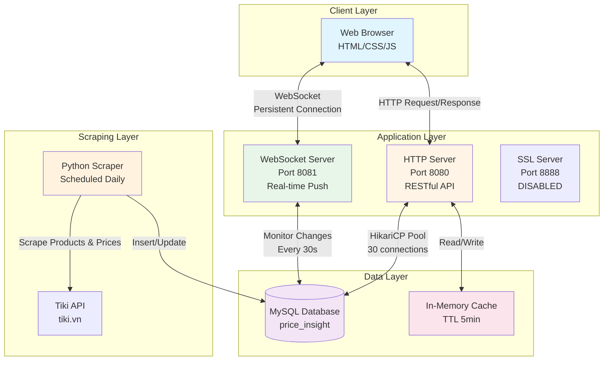

### Data Flow

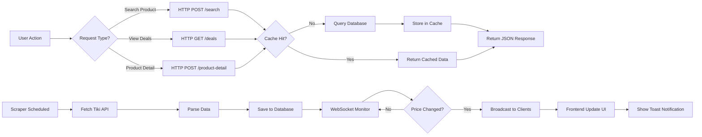

### Cấu Trúc Cơ Sở Dữ Liệu

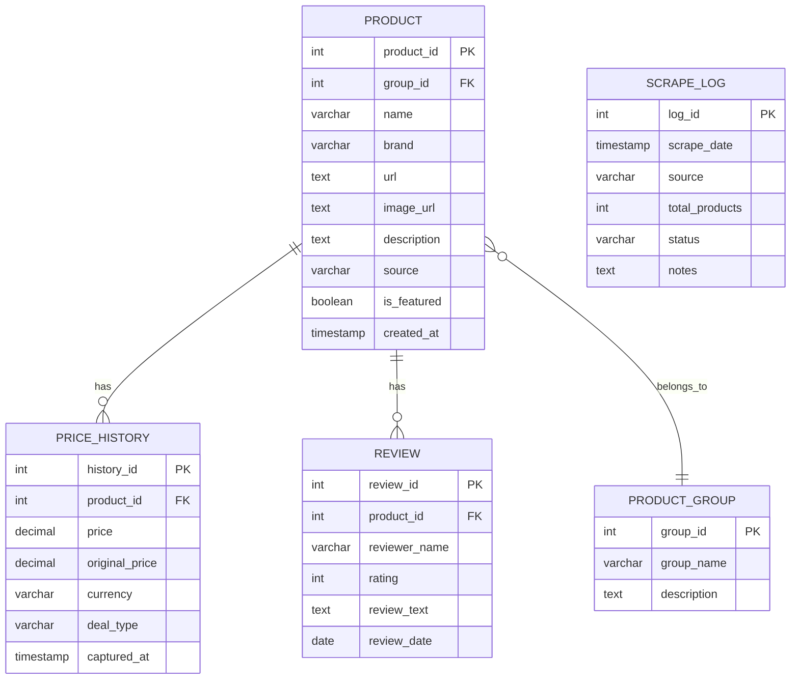

---

## Hướng Dẫn Cài Đặt Chi Tiết

### Yêu Cầu Hệ Thống

#### Phần mềm bắt buộc:
- **Java Development Kit (JDK)** 17 trở lên
- **Python** 3.8 trở lên
- **MySQL** 8.0+ (có thể dùng XAMPP)
- **Git** (để clone project)

#### Kiểm tra cài đặt:
```powershell
java -version        # Phải hiển thị Java 17+
python --version     # Phải hiển thị Python 3.8+
mysql --version      # Phải hiển thị MySQL 8.0+
```

---

### Bước 1: Clone Repository

```powershell
git clone https://github.com/QuyTran25/PROJECT_PRICE_TRACKER.git
cd PROJECT_PRICE_TRACKER
```

---

### Bước 2: Cấu Hình Database

#### 2.1. Start MySQL Server
Nếu dùng XAMPP:
```powershell
C:\xampp\xampp-control.exe  # Bật MySQL
```

Hoặc start service:
```powershell
net start MySQL
```

#### 2.2. Tạo Database
Mở MySQL client:
```powershell
mysql -u root -p
```

Chạy lệnh SQL:
```sql
CREATE DATABASE IF NOT EXISTS price_insight;
USE price_insight;
```

#### 2.3. Import Schema
```powershell
# Nếu có file dump
mysql -u root -p price_insight < database_schema.sql
```

Hoặc chạy script Python để tạo tables:
```powershell
cd scraper
python initial_setup.py
```

#### 2.4. Verify Database
```sql
SHOW TABLES;
-- Phải thấy: product, price_history, product_group, review, scrape_log
```

---

### Bước 3: Cài Đặt Dependencies

#### 3.1. Java Libraries
Download các JAR files vào `server/lib/`:

```powershell
# Tạo thư mục lib nếu chưa có
New-Item -ItemType Directory -Force -Path "server\lib"

# Download từ Maven Central
$libs = @(
    @{url="https://repo1.maven.org/maven2/com/zaxxer/HikariCP/5.1.0/HikariCP-5.1.0.jar"; name="HikariCP-5.1.0.jar"},
    @{url="https://repo1.maven.org/maven2/org/slf4j/slf4j-api/2.0.9/slf4j-api-2.0.9.jar"; name="slf4j-api-2.0.9.jar"},
    @{url="https://repo1.maven.org/maven2/org/slf4j/slf4j-simple/2.0.9/slf4j-simple-2.0.9.jar"; name="slf4j-simple-2.0.9.jar"},
    @{url="https://repo1.maven.org/maven2/com/mysql/mysql-connector-j/8.0.33/mysql-connector-j-8.0.33.jar"; name="mysql-connector-j-8.0.33.jar"},
    @{url="https://repo1.maven.org/maven2/com/google/code/gson/gson/2.10.1/gson-2.10.1.jar"; name="gson-2.10.1.jar"},
    @{url="https://repo1.maven.org/maven2/org/java-websocket/Java-WebSocket/1.5.3/Java-WebSocket-1.5.3.jar"; name="Java-WebSocket-1.5.3.jar"}
)

foreach ($lib in $libs) {
    $path = "server\lib\$($lib.name)"
    if (-not (Test-Path $path)) {
        Write-Host "Downloading $($lib.name)..."
        Invoke-WebRequest -Uri $lib.url -OutFile $path -UseBasicParsing
        Write-Host "  ✅ Downloaded"
    }
}
```

Verify:
```powershell
dir server\lib\*.jar
# Phải có 6 files
```

#### 3.2. Python Packages
```powershell
cd scraper
pip install -r requirements.txt

# Hoặc cài thủ công:
pip install requests mysql-connector-python
```

---

### Bước 4: Cấu Hình Scraper

#### 4.1. Copy config template
```powershell
cd scraper
copy config.ini.template config.ini
```

#### 4.2. Chỉnh sửa `config.ini`
Mở file `config.ini` và cập nhật:

```ini
[DATABASE]
host = localhost
port = 3306
database = price_insight
user = root
password =          # Để trống nếu không có password
charset = utf8mb4

[EMAIL]
enabled = true
smtp_server = smtp-mail.outlook.com
smtp_port = 587
sender_email = your-email@example.com
sender_password = your-password
recipients = recipient1@example.com,recipient2@example.com

[SCRAPER]
delay_between_requests = 2
request_timeout = 10
max_retries = 3
```

#### 4.3. Test scraper
```powershell
python scraper.py
```

Expected output:
```
[INFO] Đang kết nối database...
[INFO] ✓ Kết nối database thành công!
[INFO] Bắt đầu cào X sản phẩm...
```

---

### Bước 5: Tạo SSL Certificates (Optional)

```powershell
cd server\certs
.\generate-cert.bat
.\export-cert-for-client.bat
cd ..\..
```

Nhập password khi được yêu cầu: `pricetracker123`

---

### Bước 6: Compile và Start Server

#### 6.1. Compile Java source
```powershell
cd server

javac -encoding UTF-8 -d bin -cp "lib/*;../shared/src" `
    src/com/pricetracker/server/http/SimpleHttpServer.java `
    src/com/pricetracker/server/db/*.java `
    src/com/pricetracker/server/websocket/*.java `
    src/com/pricetracker/server/core/*.java `
    ../shared/src/com/pricetracker/models/*.java
```

#### 6.2. Start server
```powershell
# Quay về root folder
cd ..

# Run batch script
.\start-server.bat
```

Expected output:
```
====================================================
   🚀 PRICE TRACKER - TRIPLE SERVER MODE
====================================================

✓ HikariCP Connection Pool initialized
  ├─ Max Pool Size: 30
  └─ Database: jdbc:mysql://localhost:3306/price_insight

🌐 HTTP Server started on port 8080
⚡ WebSocket Server started on port 8081
📊 Price Update Monitoring Service started

=================================================================
   ✨ SERVERS STARTED SUCCESSFULLY!
=================================================================
Press Ctrl+C to stop all servers...
```

---

### Bước 7: Mở Frontend

#### 7.1. Mở trình duyệt
```powershell
# Double-click hoặc:
start frontend\HTML\index.html
```

#### 7.2. Test kết nối
Mở **Browser Console** (F12), phải thấy:
```
[WebSocket] ✅ Kết nối thành công!
```

#### 7.3. Test tìm kiếm
- Nhập tên sản phẩm vào thanh search
- Hoặc paste URL Tiki: `https://tiki.vn/...-p12345678.html`
- Nhấn Search

---

### Bước 8: Cấu Hình Scraper Tự Động (Optional)

#### Windows Task Scheduler:
```powershell
cd scraper
.\install_scheduler.bat
```

Hoặc thủ công:
```powershell
schtasks /create /tn "Price Tracker Scraper" /tr "C:\path\to\scraper\run_scraper.bat" /sc daily /st 02:00
```

#### Linux Cron:
```bash
crontab -e

# Thêm dòng (chạy lúc 2h sáng mỗi ngày):
0 2 * * * cd /path/to/scraper && python scraper.py
```

---

### Bước 9: Kiểm Tra Hệ Thống

#### Test HTTP API:
```powershell
# Test search endpoint
curl -X POST http://localhost:8080/search `
  -H "Content-Type: application/json" `
  -d '{\"action\":\"SEARCH_BY_NAME\",\"query\":\"iPhone\"}'

# Test deals endpoint
curl http://localhost:8080/deals

# Test metrics
curl http://localhost:8080/metrics
```

#### Test WebSocket:
Mở Browser Console:
```javascript
// Test connection
window.priceWS.ws.readyState  // Phải return 1 (OPEN)

// Test send message
window.priceWS.send({type: "ping"})
```

#### Check Database:
```sql
-- Kiểm tra số lượng sản phẩm
SELECT COUNT(*) FROM product;

-- Kiểm tra lịch sử giá
SELECT COUNT(*) FROM price_history;

-- Xem log scraper
SELECT * FROM scrape_log ORDER BY scrape_date DESC LIMIT 5;
```

---

### Xử Lý Lỗi Thường Gặp

#### Lỗi: "Port 8080 already in use"
```powershell
# Tìm process đang dùng port
netstat -ano | findstr "8080"

# Kill process
taskkill /PID <PID> /F
```

#### Lỗi: "Cannot connect to MySQL"
```powershell
# Check MySQL có chạy không
netstat -ano | findstr "3306"

# Start MySQL service
net start MySQL
```

#### Lỗi: "ClassNotFoundException: HikariCP"
```powershell
# Verify JAR files
dir server\lib\*.jar

# Re-download nếu thiếu
```

#### Lỗi: "SSL handshake failed"
```powershell
# Regenerate certificates
cd server\certs
del *.keystore *.jks
.\generate-cert.bat
.\export-cert-for-client.bat
```

#### Frontend không load dữ liệu
1. Check server có chạy: `curl http://localhost:8080/deals`
2. Check browser console có lỗi CORS không
3. Verify WebSocket: `window.priceWS.ws.readyState` phải = 1

---

## Hình Ảnh Demo và Screenshots

### Trang Chủ
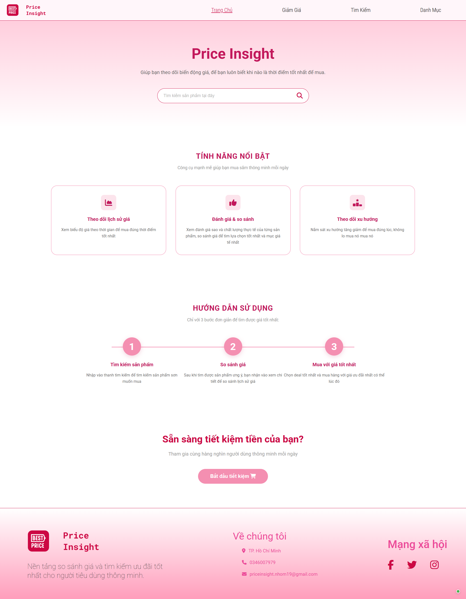

**Mô tả**: Giao diện trang chủ với banner, thanh tìm kiếm, giới thiệu về các tính năng nổi bật của website.

---

### Trang Tìm Kiếm
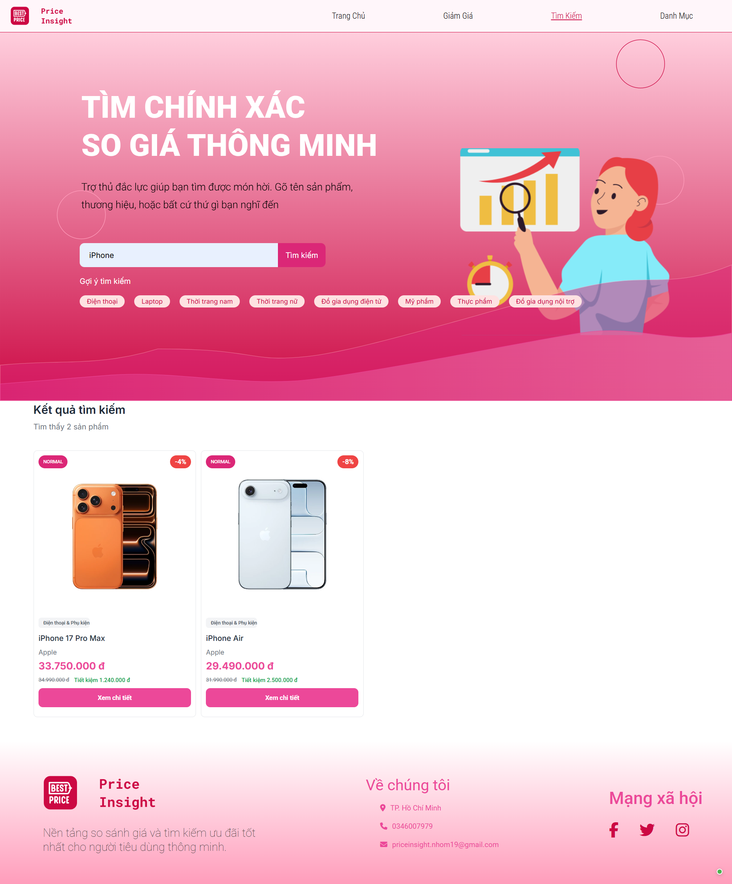

**Mô tả**: Kết quả tìm kiếm hiển thị dạng grid với ảnh sản phẩm, tên, giá, % giảm giá, và deal type badge.

---

### Trang Giảm Giá (Deals)
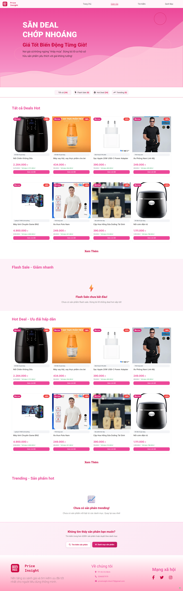

**Mô tả**: Trang deals với filter theo loại (Flash Sale, Hot Deal, Trending). Sản phẩm có badge đỏ hiển thị % giảm giá.

---

### Trang Chi Tiết Sản Phẩm
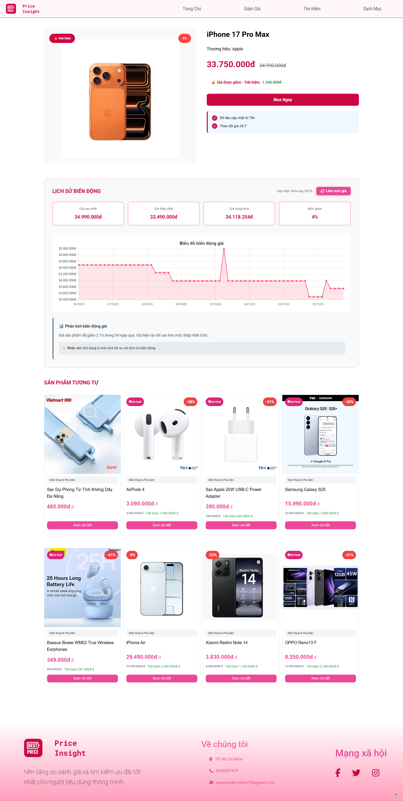

**Mô tả**: 
- Ảnh sản phẩm lớn, thông tin chi tiết (tên, brand, giá)
- Biểu đồ line chart hiển thị lịch sử giá theo thời gian (Chart.js)
- Danh sách reviews với rating stars
- Grid sản phẩm tương tự ở phía dưới


---

### Trang Danh Mục
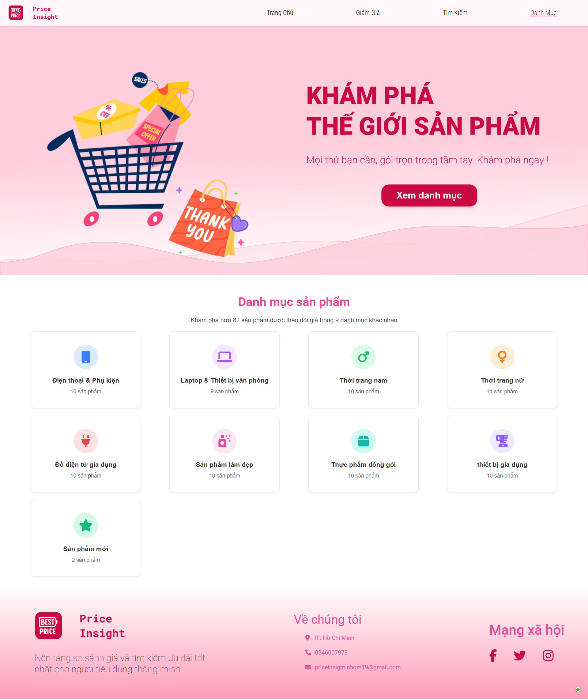

**Mô tả**: Grid categories với tên danh mục, cho phép hiển thị sản phẩm theo danh mục, lọc theo giá,...

---

### Cấu Trúc Database
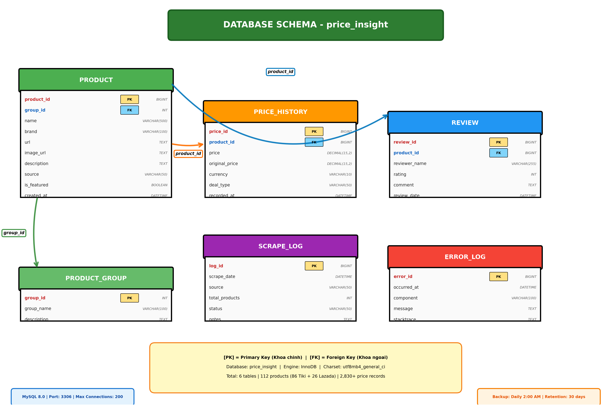

**Mô tả**: ER Diagram thể hiện các bảng: product, price_history, product_group, review, scrape_log và mối quan hệ giữa chúng.

---

### Kiến Trúc Hệ Thống
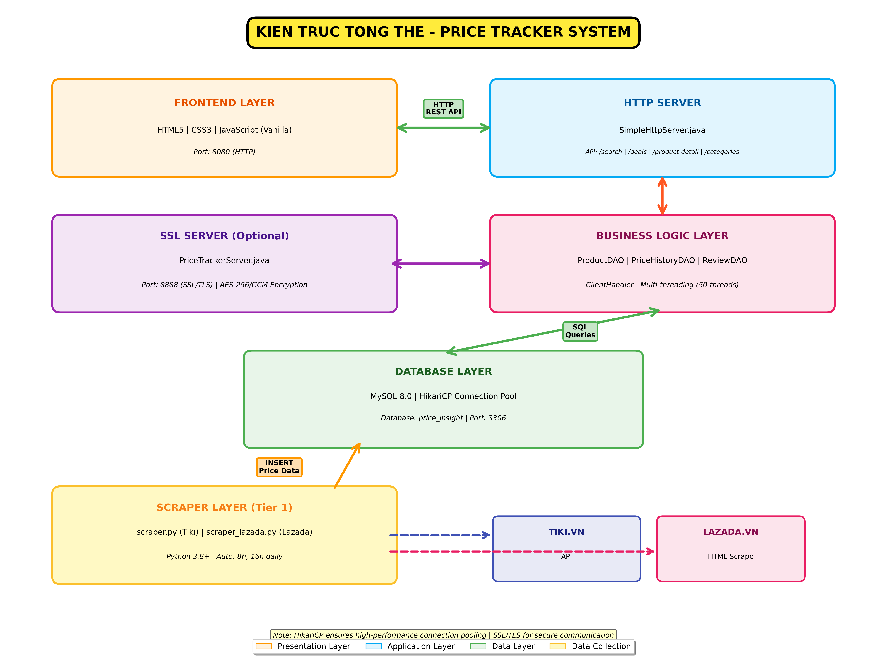

**Mô tả**: Sơ đồ kiến trúc tổng thể: Browser ↔ HTTP/WebSocket Servers ↔ Database ↔ Python Scraper ↔ Tiki API.

---

### Data Flow
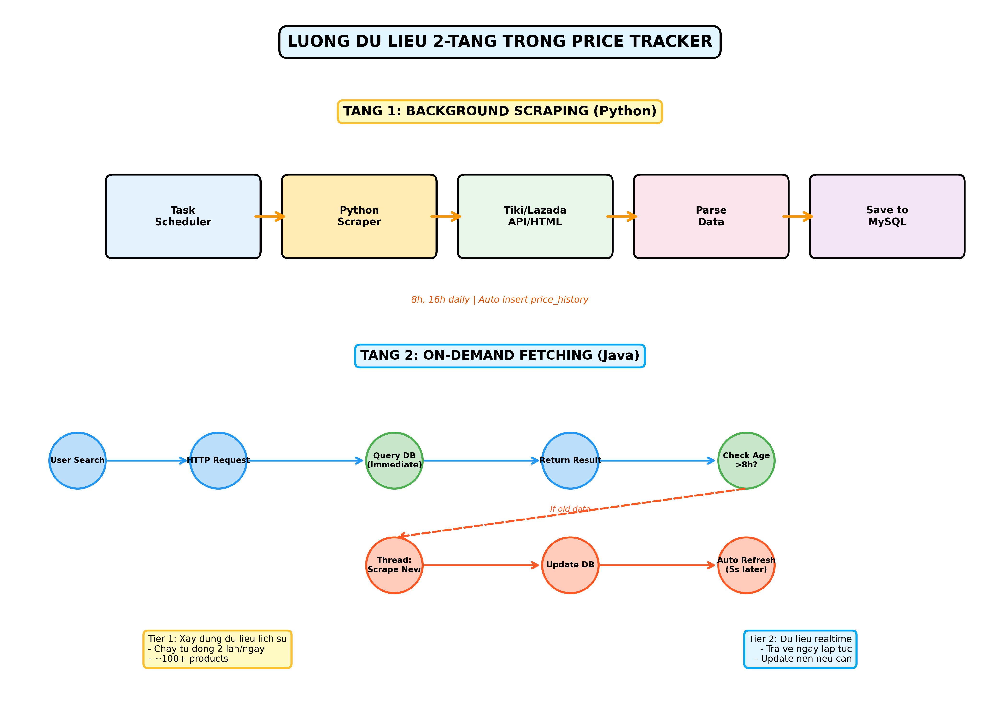

**Mô tả**: Sơ đồ luồng dữ liệu từ khi user search → query DB → return data → real-time updates qua WebSocket.

---

### TCP Protocol Diagram
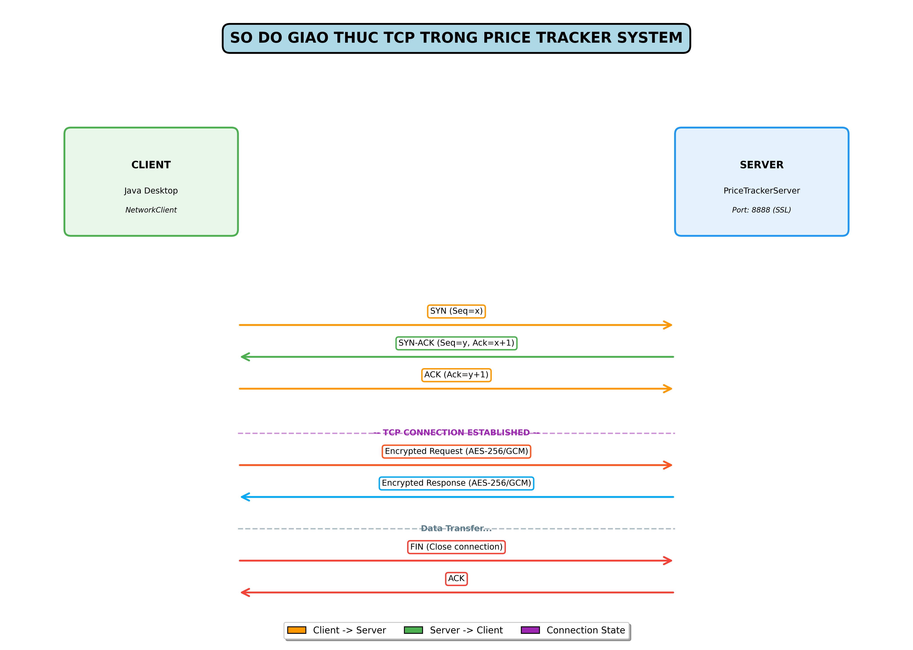

**Mô tả**: Sơ đồ chi tiết TCP handshake (SYN, SYN-ACK, ACK) và HTTP/WebSocket communication trên TCP layer.

---

## Pseudo Code - Các Thuật Toán Chính

### 1. Python Scraper - Thu Thập Dữ Liệu

```
FUNCTION scrape_products():
    products = get_products_from_database()
    
    FOR EACH product IN products:
        tiki_id = extract_id(product.url)
        price_data = call_tiki_api(tiki_id)  // Retry tối đa 3 lần
        
        IF price_data EXISTS:
            save_price_to_database(product.id, price_data)
        
        sleep(2)  // Delay tránh bị block
    
    send_email_notification()
END FUNCTION
```

### 2. HTTP Server - Xử Lý Tìm Kiếm

```
FUNCTION handle_search(request):
    keyword = request.query
    
    // Kiểm tra cache trước (TTL: 5 phút)
    IF cache.has(keyword):
        RETURN cache.get(keyword)
    
    // Query database
    products = database.execute(
        "SELECT p.*, ph.current_price 
         FROM product p 
         JOIN price_history ph ON p.id = ph.product_id
         WHERE p.name LIKE '%{keyword}%'
         LIMIT 50"
    )
    
    // Lưu cache và trả kết quả
    cache.put(keyword, products, TTL=300)
    RETURN products
END FUNCTION
```

### 3. WebSocket Server - Cập Nhật Real-time

```
FUNCTION broadcast_price_updates():
    // Chạy mỗi 30 giây
    WHILE server_running:
        sleep(30)
        
        price_changes = get_recent_price_changes()
        
        FOR EACH change IN price_changes:
            // Broadcast đến tất cả clients đang kết nối
            FOR EACH client IN connected_clients:
                send(client, {
                    type: "PRICE_UPDATE",
                    product_id: change.product_id,
                    price: change.new_price
                })
END FUNCTION
```

### 4. Database Query - Lấy Lịch Sử Giá

```
FUNCTION get_price_history(product_id):
    result = database.execute(
        "SELECT price, captured_at 
         FROM price_history
         WHERE product_id = ?
         ORDER BY captured_at DESC
         LIMIT 30"
    )
    
    RETURN format_for_chart(result)
END FUNCTION
```

---

## Thành viên phát triển

Dự án được phát triển bởi nhóm 19
<table>
  <tr>
     <td align="center">
      <a href="https://github.com/QuyTran25">
        <br />
        <sub><b>Huỳnh Thị Quý Trân (NT)</b></sub>
      </a><br />
    </td>
    <td align="center">
      <a href="https://github.com/khain7728">
        <br />
        <sub><b>Nguyễn Quốc Khải</b></sub>
      </a><br />
    </td>
    <td align="center">
      <a href="https://github.com/Shinnie102">
        <br />
        <sub><b>Nguyễn Thị Thùy Trang</b></sub>
      </a><br />
    </td>
    <td align="center">
      <a href="https://github.com/LeVietSangg">
        <br />
        <sub><b>Lê Viết Sang</b></sub>
      </a><br />
    </td>
    <td align="center">
      <a href="https://github.com/akhoa79">
        <br />
        <sub><b>Nguyễn Đỗ Anh Khoa</b></sub>
      </a><br />
    </td>
  </tr>
</table>

---

## Liên Hệ

Nếu có thắc mắc hoặc góp ý về dự án, vui lòng tạo [Issue](https://github.com/QuyTran25/PROJECT_PRICE_TRACKER/issues) hoặc liên hệ qua email nhóm trưởng.
